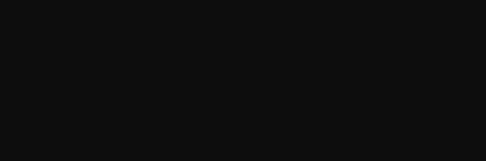

<div align="center">



</div>

Interface web do [**not-a-monolith**](https://github.com/janseealves/not-a-monolith) — o frontend onde o **MONO** ganha corpo, voz e uma laje articulada.

> MONO é o superintendente que *parece um monolito, mas é modular*. Em repouso, um bloco coeso; em trabalho, a laje dobra nas juntas — como o TARS reconfigurando o próprio corpo.

---

## O que é

Um cliente React para os módulos do backend `not-a-monolith` (FastAPI). Hoje existe um módulo:

**RAG** — ingestão de URLs, busca semântica e perguntas com resposta fundamentada nos chunks recuperados. A UI tem um painel de chat e um *inspector* que mostra exatamente o que foi recuperado: chunks, scores, top-k.

Novos módulos do backend (OCR, agents...) entram como novas rotas em `src/router.tsx` quando existirem.

---

## Stack

| | |
|---|---|
| Framework | React 19 + TypeScript |
| Build | Vite 8 |
| Estilo | Tailwind CSS 4 |
| Dados | TanStack Query 5 |
| Rotas | React Router 7 |

---

## Rodando

Pré-requisito: o backend [`not-a-monolith`](https://github.com/janseealves/not-a-monolith) rodando (por padrão em `http://localhost:8000`).

```bash
cp .env.example .env   # ajuste VITE_API_BASE_URL se necessário
npm install
npm run dev
```

Outros scripts:

```bash
npm run build     # tsc -b + vite build
npm run lint      # eslint
npm run preview   # serve o build de produção
```

---

## Estrutura

```
src/
├── api/          # cliente HTTP + endpoints (/v1/rag/*, /health)
├── types/        # espelha os schemas Pydantic do backend
├── hooks/        # useAsk, useIngest, useSources, useHealth
├── state/        # estado da conversa
├── components/
│   ├── shell/    # app shell, sidebar, navegação por módulo
│   ├── chat/     # painel de chat, composer, bubbles
│   ├── inspector/# chunks recuperados, fontes, controle de top-k
│   └── mono/     # o slab animado do MONO e seus estados
├── voice/        # a voz do MONO (seco, preciso, levemente afiado)
└── pages/        # uma página por módulo
```

A identidade visual completa — paleta, logo, regras de aplicação — vive em [`mono-brand/`](mono-brand/mono-brand-spec.md).

---

## Como este projeto é desenvolvido

Sou desenvolvedor backend. Este frontend está sendo construído em parceria com o [Claude Code](https://claude.com/claude-code) — da arquitetura de componentes ao CSS, passando pela personalidade do MONO. As decisões de produto e a integração com o backend são minhas; boa parte do React idiomático é do Claude. Sem pudor: é assim que se aprende um stack novo em 2026.
